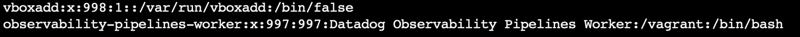
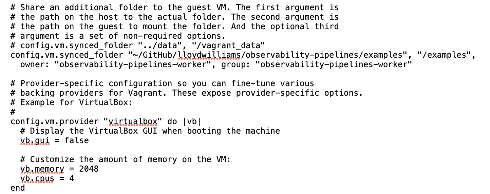
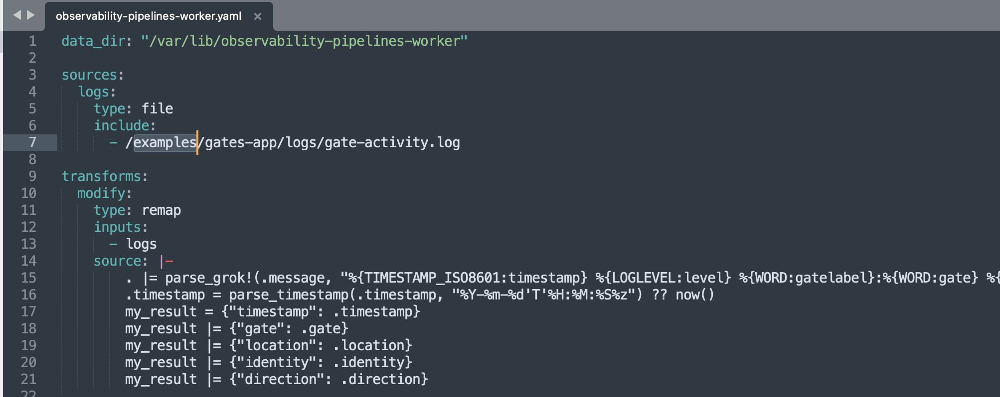

# Notes for using a Linux Vagrant Box to run Observability Pipelines

Edit: etc/ssh/sshd_config to allow password authentication to the box.


**The VirtualBox guest additions need to be added in order to be able to mount the drives.**

The observability-pipelines-worker needs to be given a password that you can use to ssh into the Vagrant box.



As the vagrant or root user, set a password for the  `observability-pipelines-worker `  user.

```
sudo passwd observability-pipelines-worker
```



Notice that the `observability-pipelines-worker` is the owner of the mounted folder where **your log files reside on your laptop**.

```
  config.vm.synced_folder "~/GitHub/lloydwilliams/observability-pipelines/examples", "/examples",
    owner: "observability-pipelines-worker", group: "observability-pipelines-worker"

  # Provider-specific configuration so you can fine-tune various
  # backing providers for Vagrant. These expose provider-specific options.
  # Example for VirtualBox:
  #
  config.vm.provider "virtualbox" do |vb|
    # Display the VirtualBox GUI when booting the machine
    vb.gui = false

    # Customize the amount of memory on the VM:
    vb.memory = 2048
    vb.cpus = 4
  end
```

 You still need to start the vagrant box as the vagrant user with ssh key so it can mount drives.

```
vagrant up
```

## Running the Observability Pipelines Worker

But after it's up and running, ssh as the observability-pipelines-worker.

```
ssh observability-pipelines-worker@127.0.0.1 -p 2222
```

It will prompt for the password that you created.

Then inside the VM, start the Op worker, with the keys: (the /vagrant directory is mounted by default so you can use a file on your mac **from within the vagrant box**).

Modify the "start-op-worker.sh" script to supply your `DD_API_KEY` and `DD_OP_CONFIG_KEY` .

```
./start-op-worker.sh
```

```
export DD_API_KEY=<MY_API_KEY>
export DD_OP_CONFIG_KEY=<MY_OP_CONFIG_KEY>

echo 'starting pipeline: /vagrant/observability-pipelines-worker.yaml'

observability-pipelines-worker run /vagrant/observability-pipelines-worker.yaml
```

With your source files using the mount folder added to the Vagrantfile owned by the observability-pipelines-worker (e.g. config.vm.synced_folder "~/GitHub/lloydwilliams/observability-pipelines/examples", "**/examples**", owner: "observability-pipelines-worker", group: "observability-pipelines-worker")

```
sources:
  logs:
    type: file
    include:
      - /examples/gates-app/logs/gate-activity.log
```

